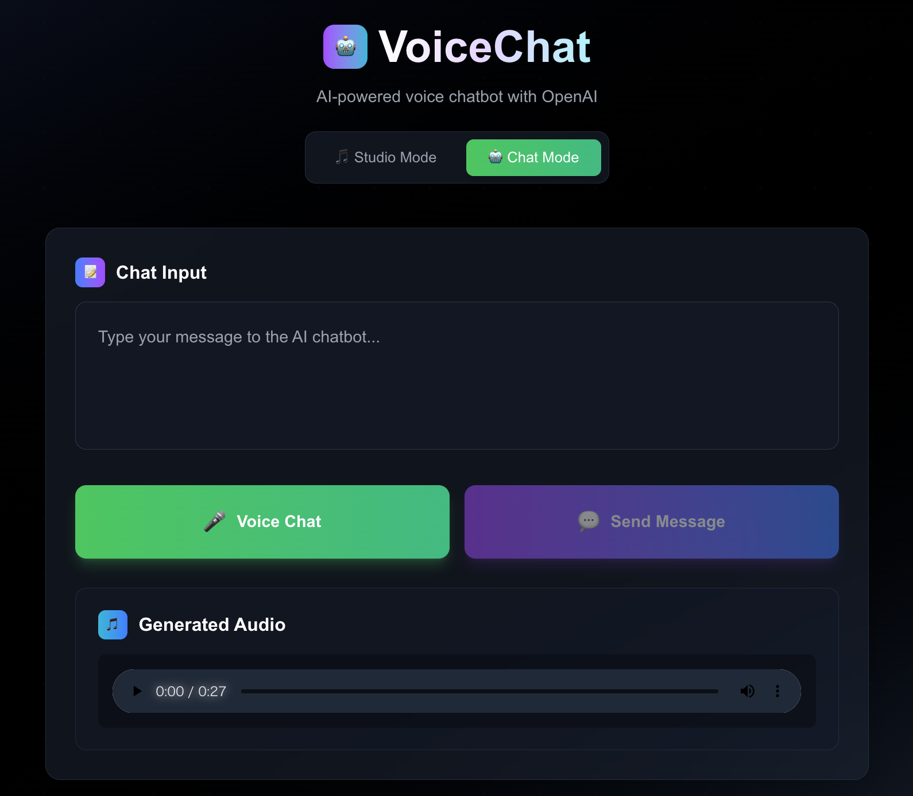

# VoiceStudio + VoiceChat 🎵🤖

Next.js、ElevenLabs API、OpenAI APIを使用したAI音声合成・認識 + リアルタイム音声チャットボットアプリケーション

<div align="center">
  
  <p><em>洗練されたダークテーマのモダンUI</em></p>
</div>

## ✨ 機能

### VoiceStudio モード
- **🔊 テキスト読み上げ (TTS)** - ElevenLabs AIを使用してテキストを自然な音声に変換
- **🎤 音声認識 (STT)** - 音声を録音してリアルタイムでテキストに変換
- **🔄 双方向インタラクション** - 音声からテキスト、テキストから音声への完全なワークフロー

### VoiceChat モード 🆕
- **🤖 AIチャットボット** - OpenAI GPT-4o-miniとの自然な会話
- **🗣️ 音声会話** - 音声入力 → AI応答 → 音声出力の完全自動化
- **💬 チャット履歴** - リアルタイムチャット表示と履歴管理
- **🔄 自動フロー** - STT → GPT → TTS の seamless な音声対話

### 共通機能
- **🌍 日本語対応** - 日本語テキスト入力と音声認識を完全サポート
- **🎨 モダンダークUI** - グラデーション背景とスムーズアニメーションの洗練されたレスポンシブインターフェース
- **⚡ リアルタイム処理** - 高速音声生成と音声認識
- **🔀 モード切替** - Studio Mode ⇄ Chat Mode の簡単切り替え

## 🚀 はじめに

### 前提条件

- Node.js 18+ 
- ElevenLabs APIキー
- OpenAI APIキー

### インストール

1. リポジトリをクローン:
```bash
git clone <repository-url>
cd eleven-labs
```

2. 依存関係をインストール:
```bash
npm install
```

3. 環境変数を設定:
```bash
cp .env.local.example .env.local
```

`.env.local`にAPIキーを追加:
```env
ELEVENLABS_API_KEY=your_elevenlabs_api_key_here
OPENAI_API_KEY=your_openai_api_key_here
```

### APIキーの取得

#### ElevenLabs APIキー
1. [ElevenLabs](https://elevenlabs.io)にアクセス
2. アカウントを作成
3. プロフィール設定に移動
4. 以下の権限でAPIキーを生成:
   - Text to Speech: `Has access`
   - Speech to Text: `Has access` 
   - Voices: `Read only`

#### OpenAI APIキー
1. [OpenAI Platform](https://platform.openai.com)にアクセス
2. アカウントを作成/ログイン
3. API Keysセクションに移動
4. 新しいAPIキーを作成
5. 課金情報を設定（GPT-4o-mini使用のため）

### アプリケーションの実行

開発サーバーを起動:
```bash
npm run dev
```

ブラウザで [http://localhost:3000](http://localhost:3000) を開きます。

## 🎛️ 使用方法

### VoiceStudio モード

#### テキスト読み上げ
1. 入力エリアにテキストを入力
2. 「Generate Speech」をクリック
3. 生成された音声を再生

#### 音声認識
1. 「Voice Input」をクリックして録音開始
2. マイクに向かって話す
3. 「Stop Recording」をクリック
4. 認識されたテキストを確認

#### 音声ワークフロー
1. 音声録音 → 自動的にテキストへ変換
2. 必要に応じてテキストを編集
3. テキストから音声を生成
4. 音声から音声への完全なインタラクション

### VoiceChat モード 🆕

#### AI音声チャットボット
1. 「Chat Mode」をクリックしてモード切替
2. 「Start Voice Chat」をクリック
3. マイクに向かって質問や会話をする
4. AIが音声で自動応答
5. チャット履歴で会話内容を確認

#### チャット機能
- **自動フロー**: 音声入力 → STT → GPT-4o-mini → TTS → 音声出力
- **履歴管理**: 全ての会話がリアルタイムで表示
- **会話クリア**: 「Clear Chat」で履歴をリセット
- **モード切替**: Studio ⇄ Chat の簡単切り替え

## 🏗️ プロジェクト構造

```
src/
├── app/
│   ├── api/
│   │   ├── tts/route.ts      # テキスト読み上げエンドポイント
│   │   ├── stt/route.ts      # 音声認識エンドポイント
│   │   ├── chat/route.ts     # OpenAI チャットエンドポイント
│   │   └── voices/route.ts   # 音声リストエンドポイント
│   ├── page.tsx              # メインアプリケーションUI（Studio + Chat統合）
│   └── layout.tsx            # アプリレイアウト
├── components/               # 再利用可能コンポーネント
└── lib/                     # ユーティリティ関数
```

## 🔧 APIエンドポイント

- `POST /api/tts` - テキストを音声に変換
- `POST /api/stt` - 音声をテキストに変換
- `POST /api/chat` - OpenAI GPTとのチャット
- `GET /api/voices` - 利用可能な音声リストを取得

## 🛠️ 使用技術

- **フレームワーク**: Next.js 15
- **言語**: TypeScript
- **スタイリング**: Tailwind CSS
- **AIサービス**: ElevenLabs API, OpenAI API (GPT-4o-mini)
- **音声処理**: Web Audio API, MediaRecorder API
- **チャット機能**: リアルタイム会話、履歴管理

## 🌐 ブラウザ対応

- Chrome/Edge 85+
- Firefox 82+
- Safari 14+

*注意: 音声認識機能にはマイクアクセスが必要です*

## 📝 設定

### 音声設定

アプリは日本語音声に最適化された固定の女性音声（`4lOQ7A2l7HPuG7UIHiKA`）を使用しています。音声を変更する場合:

1. `src/app/api/tts/route.ts`でボイスIDを更新
2. `src/app/page.tsx`でデフォルト選択を変更

### モデル設定

- **TTSモデル**: `eleven_multilingual_v2` (日本語対応)
- **STTモデル**: `scribe_v1` (多言語音声認識)

## 🚀 デプロイ

### Vercel（推奨）

1. コードをGitHubにプッシュ
2. [Vercel](https://vercel.com)にリポジトリを接続
3. `ELEVENLABS_API_KEY`と`OPENAI_API_KEY`環境変数を追加
4. 自動デプロイ

### その他のプラットフォーム

Node.jsをサポートする任意のプラットフォームにデプロイ可能:
- Netlify
- Railway
- Heroku
- AWS/GCP/Azure

## 🔒 セキュリティ

- APIキーは環境変数で安全に保存
- クライアントサイドでのAPIキー露出なし
- 音声データはサーバーサイドで処理

## 🤝 貢献

1. リポジトリをフォーク
2. フィーチャーブランチを作成
3. 変更を実装
4. 該当する場合はテストを追加
5. プルリクエストを送信

## 📄 ライセンス

このプロジェクトはMITライセンスの下でライセンスされています。

## 🙏 謝辞

- [ElevenLabs](https://elevenlabs.io) - AI音声技術の提供
- [OpenAI](https://openai.com) - GPT-4o-mini チャットボット技術
- [Next.js](https://nextjs.org) - Reactフレームワーク
- [Tailwind CSS](https://tailwindcss.com) - スタイリングユーティリティ

---

Claude Codeで ❤️ を込めて構築